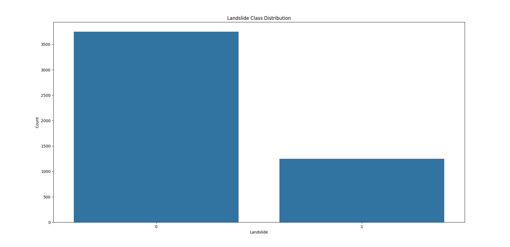
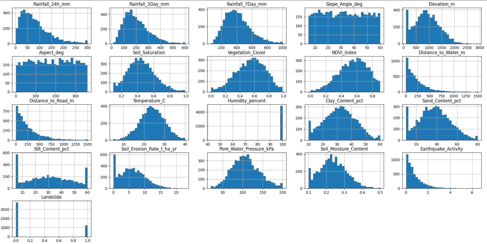
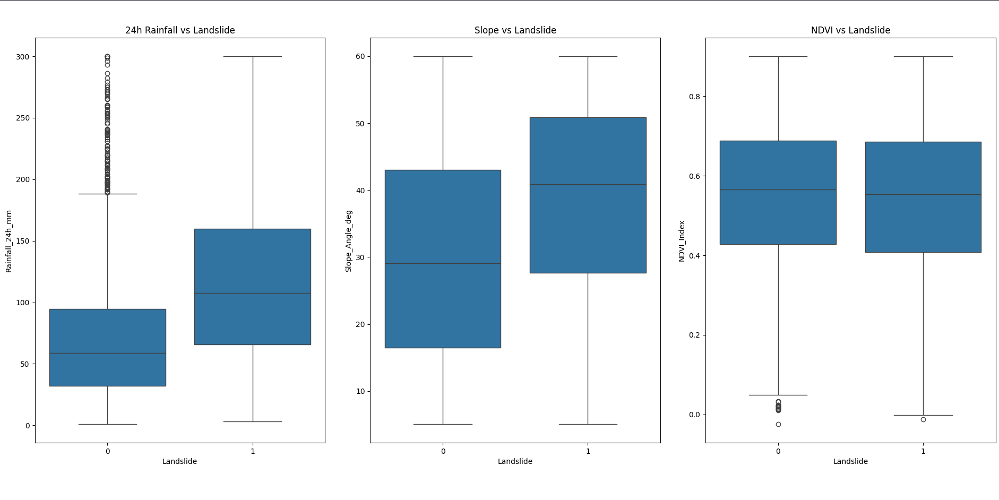
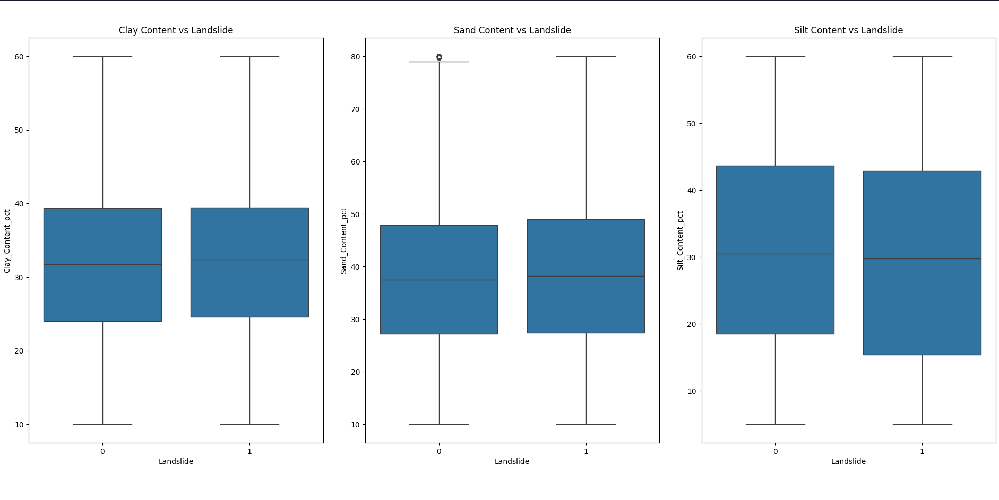
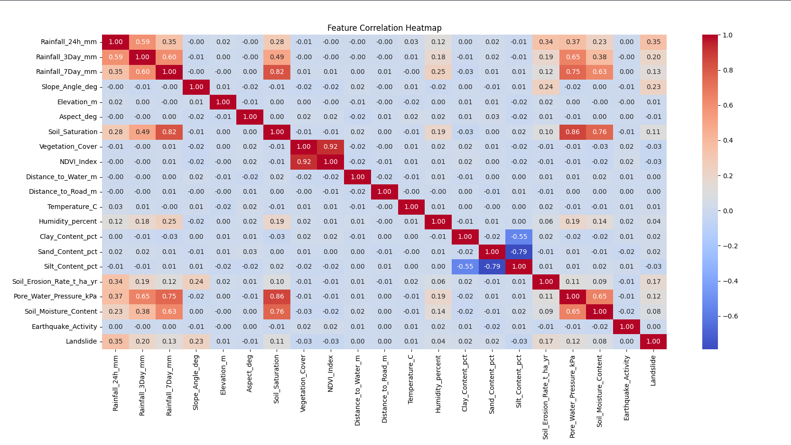
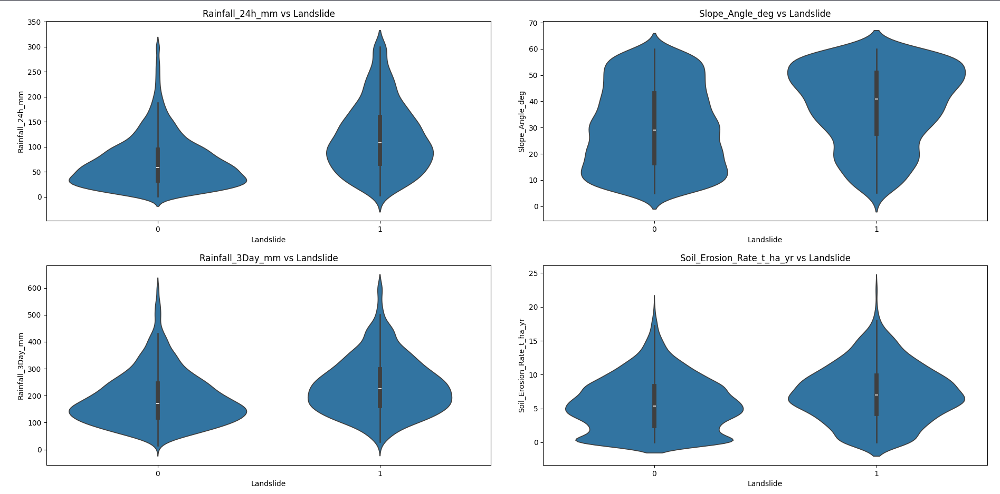

# Landslide Risk Prediction — Demo Dataset EDA Report

## 1. Dataset Overview

### Findings

- The dataset contains **5,000 observations and 21 columns**.
- There are **20 numerical input features** and one target variable, `Landslide`.
- All input features are numerical.
- No missing values were found.
- The dataset is structurally clean and suitable for initial model development.
- Since all input features are numerical, no categorical encoding is required at this stage.

---

## 2. Landslide Class Distribution

### Findings

- `Landslide = 0` represents no landslide.
- `Landslide = 1` represents landslide occurrence.
- The classes occur in approximately a **3:1 ratio**:
  - 75% → No landslide
  - 25% → Landslide

### Conclusion

The dataset is moderately imbalanced, but the imbalance is not severe enough to require immediate resampling.

However, accuracy alone should not be used as the primary evaluation metric. Precision, recall, F1-score, and ROC-AUC should also be considered during model evaluation.

---

## 3. Feature Distributions

### Findings

- Most numerical features show some degree of **right-skewness**.
- Rainfall-related variables have particularly wide and right-skewed distributions.
- `Humidity_percent` is heavily concentrated near 100%, indicating very low variation.
- `Elevation_m` contains several relatively extreme high-end observations.

### Conclusion

The dataset contains several skewed environmental variables.

Extreme values were not removed automatically because an extreme environmental observation is not necessarily an erroneous observation. Their treatment will depend on the model and the geographical context of the data.

---

## 4. Rainfall, Slope and NDVI vs Landslide

### Findings

- `Rainfall_24h_mm` shows a noticeably higher median for `Landslide = 1`.
- `Slope_Angle_deg` also shows a higher median for `Landslide = 1`.
- `NDVI_Index` shows comparatively little separation between the two classes.

### Conclusion

Rainfall and slope show the clearest individual relationships among these three features.

NDVI shows relatively weak separation between the two target classes in the current synthetic dataset.

These observations are exploratory and should not be interpreted as model feature importance.

---

## 5. Soil Composition vs Landslide

### Findings

The three soil-composition features were compared:

- `Clay_Content_pct`
- `Sand_Content_pct`
- `Silt_Content_pct`

All three show very similar distributions between `Landslide = 0` and `Landslide = 1`.

Their medians are also almost identical across the two classes.

### Conclusion

Soil composition does not show a strong direct relationship with landslide occurrence in the current synthetic dataset.

The features are retained for further modelling because they may still contribute through interactions with other environmental factors.

---

## 6. Feature Correlation Heatmap

### Findings

The strongest linear correlations with `Landslide` are:

| Feature | Correlation |
|---|---:|
| `Rainfall_24h_mm` | 0.355 |
| `Slope_Angle_deg` | 0.227 |
| `Rainfall_3Day_mm` | 0.196 |
| `Soil_Erosion_Rate_t_ha_yr` | 0.166 |
| `Rainfall_7Day_mm` | 0.132 |
| `Pore_Water_Pressure_kPa` | 0.125 |
| `Soil_Saturation` | 0.111 |

Most of the remaining features have relatively weak linear correlations with the target.

### Conclusion

Rainfall, slope, erosion, and hydrological variables show the strongest individual linear relationships with landslide occurrence.

However, correlation only describes linear association. A low correlation does not necessarily mean that a feature has no predictive value, especially for nonlinear models such as Random Forest or XGBoost.

---

## 7. Inter-Feature Correlations

The correlation analysis also revealed several strongly related feature groups.

### Findings

#### Rainfall and hydrological variables

- `Rainfall_7Day_mm` ↔ `Soil_Saturation` → **0.82**
- `Soil_Saturation` ↔ `Pore_Water_Pressure_kPa` → **0.86**
- `Soil_Saturation` ↔ `Soil_Moisture_Content` → **0.76**

These relationships indicate a strong connection between rainfall accumulation and soil-water conditions within the synthetic dataset.

#### Vegetation variables

- `Vegetation_Cover` ↔ `NDVI_Index` → **0.92**

This indicates that these two features contain highly overlapping information.

#### Soil composition

- `Clay_Content_pct` ↔ `Silt_Content_pct` → **-0.55**
- `Sand_Content_pct` ↔ `Silt_Content_pct` → **-0.79**

The relationships are expected because these variables represent different components of the same soil composition.

### Conclusion

Several input features contain overlapping information, particularly among rainfall/hydrological variables and vegetation variables.

This should be considered when interpreting model feature importance and when deciding whether some features are redundant.

---

## 8. Top Features — Violin Plot

### Findings

The four features with the strongest observed linear relationships with the target were visualized together:

- `Rainfall_24h_mm`
- `Slope_Angle_deg`
- `Rainfall_3Day_mm`
- `Soil_Erosion_Rate_t_ha_yr`

`Rainfall_24h_mm` and `Slope_Angle_deg` show the clearest distributional separation between `Landslide = 0` and `Landslide = 1`.

`Rainfall_3Day_mm` and `Soil_Erosion_Rate_t_ha_yr` also show some separation, although it is less pronounced.

### Conclusion

The violin plots reinforce the earlier correlation analysis.

**Short-term rainfall and slope appear to be the strongest individual candidate predictors in the current synthetic dataset**, while longer-term rainfall and erosion provide additional but weaker separation.

---

# 9. Overall EDA Conclusion

The exploratory analysis produced the following observations:

- The dataset contains **5,000 observations and 20 numerical features**.
- No missing values were found.
- The target has a moderate **3:1 class imbalance**.
- Rainfall and slope show the clearest individual relationships with landslide occurrence.
- Hydrological variables such as soil saturation, soil moisture, and pore-water pressure show strong relationships with rainfall and with each other.
- `Vegetation_Cover` and `NDVI_Index` are highly correlated and contain overlapping information.
- Soil composition shows little direct separation between the two target classes.
- `Humidity_percent` has very limited variation.
- `Elevation_m` contains relatively extreme high-end observations, but these were not automatically removed because they may represent valid environmental conditions.
- `Aspect_deg` was not included in the final EDA visualizations, but remains available as an input feature for later modelling.

Overall, the EDA indicates that the synthetic dataset contains sufficient structure to proceed to model development, with **rainfall, slope, erosion, and hydrological conditions** emerging as the strongest initial candidate predictors.

> **Dataset limitation:** This is a synthetic prototype dataset. The observed relationships should not be interpreted as real-world evidence of landslide causation or real feature importance. The purpose of this dataset is to develop and test the initial ML pipeline before replacing the inputs with real GIS, rainfall, vegetation, soil, and terrain data.

## 10. Next Step

The next stage is **model development and evaluation**:

**EDA → Train/Test Split → Preprocessing → Baseline Model → Evaluation → Model Comparison**
