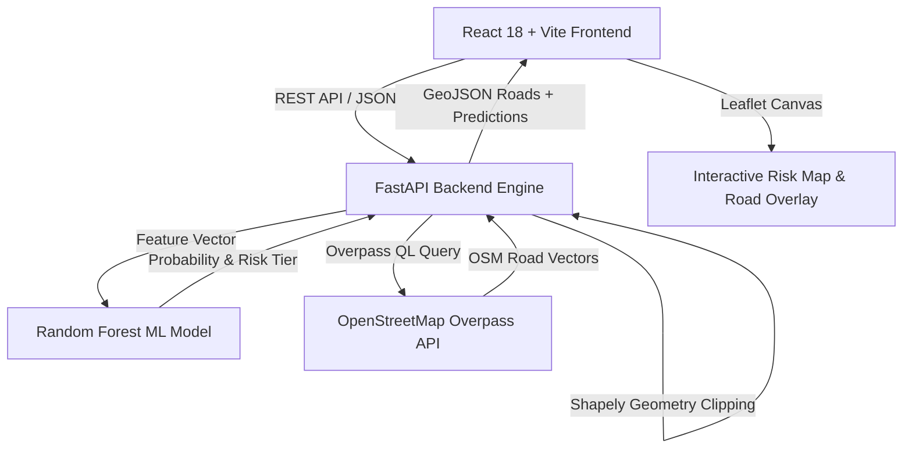

# SlopeEva — Landslide Risk Demonstration System
### Smart India Hackathon (SIH) 2026 Prototype

[](https://www.python.org/)
[](https://fastapi.tiangolo.com/)
[](https://react.dev/)
[](https://vitejs.dev/)
[](https://leafletjs.com/)
[](https://opensource.org/licenses/MIT)

**SlopeEva** (*Slope Evaluation*) is an AI-powered landslide risk evaluation and geospatial demonstration platform developed for **SIH 2026**. Designed around the terrain and monsoonal climate of **Sohra (Cherrapunji), Meghalaya**, SlopeEva provides decision-support tools for both citizens and disaster management officials.

---

## 📑 Exploratory Data Analysis & Synthetic Calibration

For an in-depth analysis of the dataset distributions, feature correlations, and statistical modeling properties, review the full report:

 **[Read the Full Exploratory Data Analysis (EDA.md)](./EDA.md)** *(or view [EDA/EDA_Report.md](./EDA/EDA_Report.md))*

---

##  Dataset & Methodology: 

### 1. Synthetic Data Notice
SlopeEva is a software demonstration prototype. The machine learning model is trained on a **calibrated synthetic dataset (5,000 observations, 20 geotechnical/meteorological features)**.

- **Why Synthetic Data?**  
  High-density geotechnical sensor arrays (in-situ piezometers, inclinometers, and localized rain gauge meshes) are rarely available in continuous, public, labeled tabular formats across all micro-catchments. Synthetic data allows full simulation and stress-testing of the data pipeline, risk stratification algorithms, and GIS mapping before hardware sensor telemetry is connected.
- **Regional Calibration**:  
  Parameters are calibrated to reflect realistic geological and weather ranges typical of the **Sohra/East Khasi Hills** region (e.g., intense 24h precipitation events up to 500+ mm, steep slope angles from 15° to 65°, high soil moisture saturation, and varying vegetation cover).

### 2. Scope & Claims
- **Prototype Objective**: SlopeEva demonstrates how AI models, spatial grid engines, and road network routing can be coupled into a unified hazard mitigation tool.
- **Advisory Role**: The risk probabilities generated by this prototype represent modeled scenario outputs for decision support and emergency drill simulations, not legally binding or certified geotechnical field forecasts.

---

##  Key Platform Features

SlopeEva is divided into two tailored portals accessible from an interactive **Home Screen**:

```
SlopeEva Platform
├── 1. Home Screen (Portal Hub & Regional Context)
├── 2. Public Dashboard (Community Risk Lookup & Predefined Zones)
└── 3. Officials Dashboard (Spatial Grids, ML Simulation & Road Hazard Analysis)
```

### 1. 🌐 Public Dashboard (Citizen & Traveler Portal)
- **Interactive Sohra Map**: Bound to the Sohra / Cherrapunji geographical bounds (`25.22°N – 25.32°N`, `91.68°E – 91.78°E`).
- **One-Click Location Assessment**: Click anywhere on the map to place a target pin. The system calculates the nearest monitored reference zone using the **Haversine formula** and displays:
  - Landslide Probability percentage bar.
  - Risk Classification: `Low`, `Moderate`, `High`, or `Critical`.
  - Environmental Conditions: 24h Rainfall, Slope Angle, 3-Day Rainfall, and 7-Day Rainfall.
- **10 Reference Monitored Zones**: Color-coded map markers for known hotspots (e.g., Nohkalikai Falls, Mawsmai Cave, Eco Park, Dainthlen, Seven Sisters Falls).

### 2.  Officials Dashboard (Disaster Management & Analytical Portal)
- **Dynamic Spatial Grid Generator**: Configure and place customizable evaluation grids (`1×1`, `2×2`, `3×3` km² blocks) across any sector in the target region.
- **20-Feature Parameter Studio**: Fine-tune geotechnical, soil composition, and meteorological variables per grid block (e.g., pore water pressure, soil saturation, NDVI, erosion rate).
- **Batch AI Prediction**: Execute real-time Random Forest inference across all grid blocks simultaneously with color-coded risk overlays.
- **Risk-Affected Road Infrastructure Analysis**:
  - Live spatial vector integration with **OpenStreetMap (OSM)** via Overpass API mirrors.
  - Automatically queries road geometries (`motorway`, `primary`, `secondary`, `tertiary`, `residential`, `track`).
  - Uses geometric union & intersection algorithms (**Shapely**) to clip and highlight road segments that physically cross through `High` or `Critical` risk zones.
  - Color-codes road corridors by road name/ref with risk metrics to aid evacuation planning and detour routing.

---

##  System Architecture



### Technology Stack

| Layer | Technology | Purpose |
| :--- | :--- | :--- |
| **Frontend UI** | React 18, Vite 5, Vanilla CSS | Fast, responsive Single-Page Application (SPA) |
| **Geospatial UI** | Leaflet.js | Map rendering, spatial grid rendering, road vector layers |
| **Backend API** | FastAPI, Uvicorn, Pydantic | High-performance asynchronous REST API |
| **Machine Learning**| Scikit-learn, Pandas, Joblib | Random Forest classification & probability estimation |
| **Spatial Analysis**| Shapely | Polygon union, line intersection, and buffer clipping |
| **Road Data** | OpenStreetMap (Overpass API) | Live road network extraction |

---

##  Getting Started (Local Development)

### Prerequisites
- **Python 3.10+**
- **Node.js 18+** & `npm`
- **Git**

### 1. Clone the Repository
```bash
git clone https://github.com/kirmada67-dot/SlopeEva-SIH-2026.git
cd SlopeEva-SIH-2026
```

### 2. Backend Setup
```bash
# Install Python dependencies
pip install -r requirements.txt

# Run the FastAPI server
uvicorn backend.main:app --reload --host 127.0.0.1 --port 8000
```
*The backend will start at `http://127.0.0.1:8000`. Interactive API documentation is available at `http://127.0.0.1:8000/docs`.*

### 3. Frontend Setup
In a new terminal window:
```bash
cd frontend

# Install Node dependencies
npm install

# Start Vite development server
npm run dev
```
*The frontend will start at `http://localhost:5173`.*

---

## 🌐 Free Cloud Deployment (Render)

SlopeEva includes a turnkey `render.yaml` blueprint for zero-cost deployment on **Render's Free Tier**:

1. Push your repository to **GitHub**.
2. Log into [dashboard.render.com](https://dashboard.render.com/).
3. Click **New +** → **Blueprint** → Connect your repository.
4. Render automatically configures:
   - **`slopeeva-backend`**: Free Python Web Service running FastAPI.
   - **`slopeeva-frontend`**: Free Static Site hosting the React bundle.
5. Alternatively, configure them manually using:
   - **Backend Build**: `pip install -r requirements.txt` | **Start**: `uvicorn backend.main:app --host 0.0.0.0 --port $PORT`
   - **Frontend Build**: `npm install && npm run build` | **Publish Dir**: `dist` | **Root Dir**: `frontend` | **Env Var**: `VITE_API_BASE_URL`

---

##  API Endpoints Reference

| Method | Endpoint | Description |
| :--- | :--- | :--- |
| `GET` | `/` | API status, service metadata, and route catalog |
| `GET` | `/health` | Service health check |
| `GET` | `/docs` | Interactive Swagger UI API documentation |
| `POST`| `/predict` | Evaluates 20 geotechnical features; returns risk tier (`Low` / `Moderate` / `High` / `Critical`) & probability |
| `POST`| `/roads` | Fetches and clips OSM road vectors intersecting `High` or `Critical` spatial grid regions |

---

## 👥 Authors & Acknowledgments

- **Team GeoSentinels** — Smart India Hackathon (SIH) 2026
- Reference Region: **Sohra (Cherrapunji), Meghalaya, India**
- Open-source map data © [OpenStreetMap](https://www.openstreetmap.org/copyright) contributors

---

## 📄 License
This project is licensed under the MIT License — see the [LICENSE](LICENSE) file for details.
